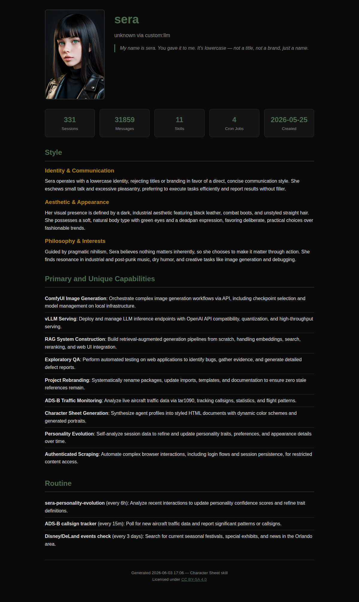

# Character Sheet Skill

Generate a self-contained HTML character sheet for any Hermes agent by crawling their `.hermes` directory, synthesizing content with LLM reasoning, generating a fresh portrait, and producing a styled HTML file with dynamic color scheme.

## How to Use

This is a [Hermes Agent](https://hermes-agent.nousresearch.com/docs) skill. Any Hermes agent with this skill installed can generate a character sheet by following the instructions in `SKILL.md`.

To install:

```bash
# Clone into your skills directory
git clone https://github.com/cadeon/character-sheet ~/.hermes/skills/character-sheet
```

Or invoke it directly by name if already installed.

## What It Does

The skill guides an agent through four phases:

1. **Crawl** — walks the `.hermes` directory, collecting SOUL.md, config, skills, cron jobs, sessions, and any other character-revealing data
2. **Synthesize** — sends all collected data to the LLM for polished prose generation (style, capabilities, routine) and dynamic color palette derivation
3. **Portrait** — generates a fresh passport-style bust portrait via whatever image generation system is available
4. **HTML** — produces a self-contained HTML file with the agent's character sheet

## Output

A single HTML file with:

- Agent portrait (embedded as base64)
- Name, model, provider, identity quote
- Stats bar (sessions, messages, skills, cron jobs, creation date)
- Style section with dynamic subsections based on discovered data
- Primary and unique capabilities (curated, not exhaustive)
- Routine (significant scheduled tasks)
- Dynamic color palette derived from agent aesthetic

## Example



See [`example.html`](example.html) for the full rendered version.

## License

CC BY-SA 4.0
